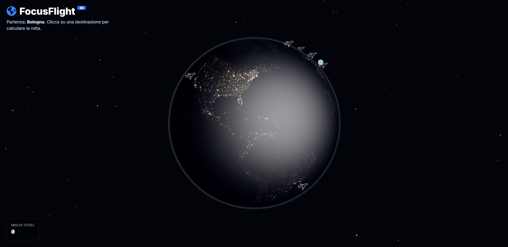

# ✈️ FocusFlight 3D - Earth Edition

**FocusFlight 3D** is an immersive productivity app that turns your study or work sessions ("Deep Work") into virtual air trips around the world.

Instead of a simple timer, pick a destination on the 3D globe: the flight duration (and thus your focus session) is calculated based on the real distance from the departure base (Bologna).



---

## ✨ Features

- **Interactive 3D Globe:** Explore the Earth, rotate the view, and click on cities to plan your trip.
- **Dynamic Duration:** Focus time is calculated from real distance (Rome = short, Sydney = long).
- **Immersive Flight Mode:**
  - 3D airplane animation that follows a parabolic route.
  - Cinematic camera that follows the plane with dynamic zoom.
  - Ability to rotate the view around the plane during the flight.
- **Ambient Audio:** Brown noise generator to support concentration.
- **Gamification:** Earn "air miles" by completing sessions without interrupting the flight.

---

## 📂 Project Structure

```
FocusFlight/
├── index.html
├── style.css
├── app.js
├── README.md
└── assets/
    ├── earth.jpg
    ├── plane.webp
    ├── plane_flying.webp
    └── plane.glb
```

---

## 🚀 How to Run the Project

Because of browser policies (CORS), you must use a local server.

### Option A — VS Code (Recommended)
1. Install **Live Server**
2. Open the project
3. Right-click `index.html` → **Open with Live Server**

### Option B — Python
```
python -m http.server
```
Open: `http://localhost:8000`

### Option C — Node.js
```
npm install -g http-server
http-server .
```

---

## 🛠️ Assets Configuration

Add to the `assets/` folder:

- earth.jpg – earth texture
- plane.glb – 3D model (GLB/GLTF)
- plane.webp / plane_flying.webp – transparent icons

---

## 🎮 Controls

### Map
- Click + drag → rotate the Earth  
- Wheel → zoom  
- Click on a city → choose destination  

### In Flight
- The plane flies automatically  
- Click + drag → rotate the camera  
- Stop → return to the map  

---

## 💻 Technologies Used

- HTML5 / CSS3  
- Tailwind CSS  
- Three.js  
- FontAwesome  

---

## 📝 License

MIT License
